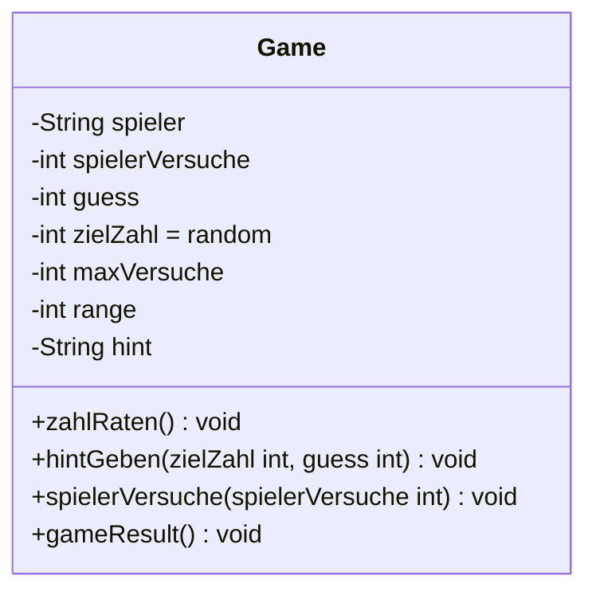

# UML – Klassendiagramm: Zahlenraten-Spiel

## Klasse: `Game`

### Attribute

| Sichtbarkeit | Name | Typ | Standardwert |
|:---:|---|---|---|
| `-` | spieler | String | |
| `-` | spielerVersuche | int | |
| `-` | guess | int | |
| `-` | zielZahl | int | `random` |
| `-` | maxVersuche | int | |
| `-` | range | int | |
| `-` | hint | String | |

### Methoden

| Sichtbarkeit | Signatur | Rückgabe |
|:---:|---|---|
| `+` | zahlRaten() | void |
| `+` | hintGeben(zielZahl : int, guess : int) | void |
| `+` | spielerVersuche(spielerVersuche : int) | void |
| `+` | gameResult() | void |

> **Legende:** `-` = private, `+` = public

---

## Mermaid-Diagramm

